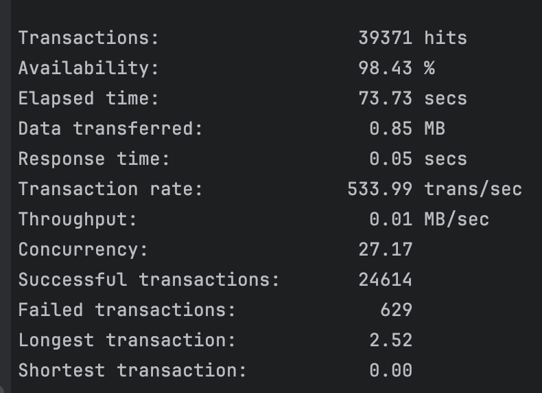
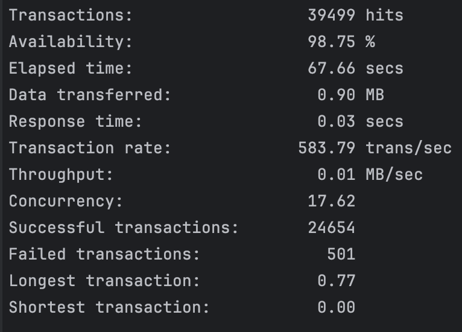

# HSA12  12. NoSQL Databases: Redis

## Redis Cluster

Build master-slave redis cluster.

Try all eviction strategies.

Write a wrapper for Redis Client that implement probabilistic cache.

## Running the Application
Start the Redis master-slave setup using Docker Compose:
````bash
docker compose up
- ````

## Testing with Siege
To stress test the application and evaluate caching strategies:
````bash
bash ./siege/test.sh
````

## Results



The implementation of probabilistic caching showed a significant improvement in performance by reducing database load during peak times. The optimized strategy further enhanced the reliability of the caching system under high load conditions.